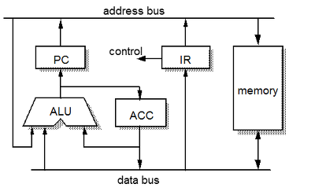
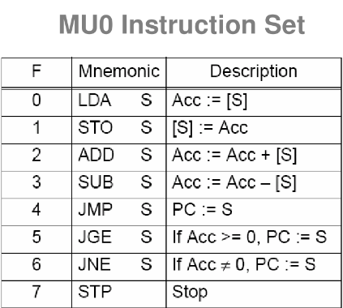

# MU0 Plus:

MU0 Plus é uma arquitetura de computador criada por mim, se trata de uma versão simples, porém, com mais funcionalidades em comparação a arquitetura MU0.

## overview da arquitetura MU0:

### arquitetura MU0

<div align="center">
    
    <br/>
    http://users.cecs.anu.edu.au/~Gerard.Borg/public/clab4.pdf
</div>

### conjunto de instruções da arquitetura MU0

<div align="center">
    
    <br/>
    https://gomoveyongs.tistory.com/6
</div>

# simulação da MU0 Plus:

o foco principal deste repositório é a maquina virtual contida nele. fiz esta VM para simular a minha versão da arquitetura MU0, a MU0 Plus. esta VM é feita inteiramente em C e pode ser reprogramada ao mudar seus valores e endereços de memória manualmente.

``` c
mem[0x1119] = 0x00090000;   // or  0000
mem[0x111a] = 0x000a0000;   // xor 0000
mem[0x111b] = 0x000b0000;   // shl 0000
mem[0x111c] = 0x000c0000;   // shr 0000
```

<br/>

segue abaixo uma documentação básica da **maquina virtual** MU0 Plus. nesta documentação, todos os detalhes importantes sobre a arquitetura MU0 Plus estão ressaltados, portanto, é o necessário para se obter entendimento sobre o seu funcionamento.

# § memória

``` c
int32_t mem[INT16_MAX];
``` 

|  estrutura da memória  | tamanho (hex)  |
|------------------------|----------------|
| memória de dados       | 0000  - 1110   |
| memória de instruções  | 1110  - ffff   |

esta maquina virtual tem sua **memória com capacidade de 32 bits** e ultiliza **16 bits para endereçamento**

exemplo:
``` c
// endereço na memória    conteúdo dentro daquele endereço
      mem[0x0000]      =          0x00030001;
      mem[0x0001]      =          0x00010000;
``` 
os endereços podem ir de **0000** até **ffff** e seus conteúdos podem ter valores de **00000000** até **ffffffff**

### por que os endereços de memória são organizados assim?

porque cada instrução da maquina virtual usa **16 para o opcode** e **16 bits para o operando**, portanto, uma instrução tipo: *jmp 1112* pode apenas usar 16 bits como parâmetro (endereço para onde o salto será efetuado), e pode ser representada na memória da seguinte maneira:

``` c
// endereço 0xaaaa contem: jmp 0x1112
mem[0xaaaa] = 0x000d1112;
``` 
sendo *000d* o valor do opcode da instrução JMP e *1112* sendo o parâmetro desta instrução

# § registradores 
``` c
// registradores
struct reg {
    int32_t pc, cir, mar, mbr, acc;
} reg;
```

essa maquina virtual conta com 5 registradores:

<ul>
    <li>PC --> program counter (contador de programa)</li>
    <li>CIR --> current instruction register (registrador de instrução atual)</li>
    <li>MAR --> memory address register (registrador de endereço de memoria)</li>
    <li>ACC --> accumulator (acumulador)</li>
</ul>

existe também uma flag extra que serve para apontar o estado de execução máquina virtual (se ela está ligada ou desligada)
``` c
bool running = true;
```
>  DETALHE: ele é definido com o valor *true* por padrão, para que a maquina virtual entenda que ela está ligada na inicialização, senão, ela seria inicializada iria e desligar logo em seguida 

# § instruções 

a maquina virtual conta com 17 instruções, segue abaixo: nome, significado e efeito que cada instrução tem sobre a maquina virtual:

### LDA
- LDA --> "Load Accumulator" (carregar acumulador)
- recebe um endereço de memória como parâmetro e carrega o acumulador com o valor que estiver naquele endereço 
### STO
- STO --> "Store" (armazenar)
- recebe um endereço de memória como parâmetro e carrega este endereço com o valor atual do acumulador 
### CLA
- CLA --> "Clear Accumulator" (limpar acumulador)
- não recebe nenhum parâmetro, apenas limpa o valor atual do acumulador, zerando seu valor

### ADD
- ADD --> "Add" (incrementar)
- recebe um endereço de memória como parâmetro e soma o valor atual do acumulador com o valor deste endereço 
### SUB
- SUB --> "Subtract" (subtrair)
- recebe um endereço de memória como parâmetro e subtrai o valor atual do acumulador com o valor deste endereço
### MUL
- MUL --> "Multiply" (multiplicar)
- recebe um endereço de memória como parâmetro e multiplica o valor atual do acumulador com o valor deste endereço
### DIV
- DIV --> "Divide" (dividir)
- recebe um endereço de memória como parâmetro e divide o valor atual do acumulador com o valor deste endereço

### AND
- AND --> "logical AND" (E)
- recebe um endereço de memória como parâmetro e efetua um AND (E) no valor atual do acumulador com o valor deste endereço 
### OR
- OR --> "logical OR" (OU)
- recebe um endereço de memória como parâmetro e efetua um OR (OR) no valor atual do acumulador com o valor deste endereço 
### XOR
- XOR --> "Exclusive OR" (OU exclusivo)
- recebe um endereço de memória como parâmetro e efetua um XOR (OU exclusivo) no valor atual do acumulador com o valor deste endereço 

### SHL
- SHL --> "Shift Left" (deslocar para a esquerda)
- recebe um endereço de memória como parâmetro e desloca para a esquerda o valor atual do acumulador com o valor deste endereço
### SHR
- SHR --> "Shift Right" (deslocar para a direita)
- recebe um endereço de memória como parâmetro e desloca para a direira o valor atual do acumulador com o valor deste endereço 

### JMP
- JMP --> "Jump" (saltar)
- recebe um endereço de memória como parâmetro e aponta o registrador PC para este endereço
### JGE
- JGE --> "Jump if Greater or Equal" (saltar se é maior ou igual a)
- recebe um endereço de memória como parâmetro e aponta o registrador PC para este endereço se o valor atual do acumulador for maior ou igual a 0
### JNE
- JNE --> "Jump if Not Equal" (saltar se é diferente de)
- recebe um endereço de memória como parâmetro e aponta o registrador PC para este endereço se o valor atual do acumulador for diferente de 0
### JAC
- JAC --> "Jump Accumulator" (saltar para acumulador)
- não recebe nenhum parâmetro, apenas aponta o PC para o valor atual do acumulador

# segue abaixo a tabela contendo um sumario de todas as instruções desta maquina virtual:

| opcode (hex) | instrução   | efeito sobre a maquina virtual   |
|--------------|-------------|----------------------------------|
| 0001         | LDA S       | ACC = mem[S]                     |
| 0002         | STO S       | mem[S] = ACC                     |
| 0003         | CLA         | ACC = 0                          |
| 0004         | ADD S       | ACC += mem[S]                    |
| 0005         | SUB S       | ACC -= mem[S]                    |
| 0006         | MUL S       | ACC *= mem[S]                    |
| 0007         | DIV S       | ACC /= mem[S]                    |
| 0008         | AND S       | ACC &= mem[S]                    |
| 0009         | OR S        | ACC ~= mem[S]                    |
| 000A         | XOR S       | ACC ^= mem[S]                    |
| 000B         | SHL S       | ACC << mem[S]                    |
| 000C         | SHR S       | ACC >> mem[S]                    |
| 000D         | JMP S       | pc = S                           |
| 000E         | JGE S       | if ACC >= 0; pc = S              |
| 000F         | JNE S       | if ACC != 0; pc = S              |
| 0010         | JAC         | PC = ACC                         |
| 0011         | HALT        | running = false                  |
